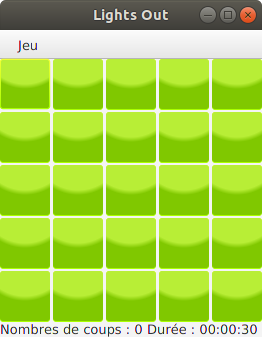
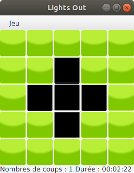
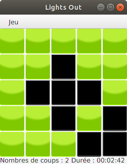
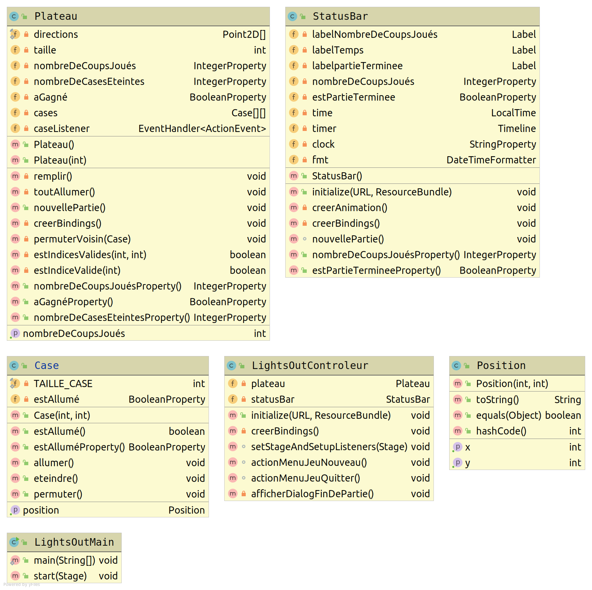

#  Module 2105 : Introduction aux IHM en Java 

## Test d'IHM et langage Java [](https://travis-ci.com/IUTInfoAix-M2105/TestIHM2019)

**Test du samedi 8 juin 2019 – Durée 2 heures – Documents autorisés**

L'objectif de cet exercice est la programmation d'une version JavaFx du jeu **Lights Out**. Lights Out est un jeu électronique publié par Tiger Electronics en 1995. 

Le jeu consiste en une grille de lumières de 5 sur 5. Lorsque le jeu commence, un nombre aléatoire ou un ensemble mémorisé de ces lumières est activé. En appuyant sur l'une des lumières, vous basculerez sur celle-ci et sur les lumières adjacentes. Le but du puzzle est d’éteindre toutes les lumières, de préférence en appuyant le moins possible sur les boutons.


### Travail à réaliser

L'IHM que vous allez en partie réaliser ressemblera aux fenêtres suivantes :

 `    `  `    ` 

L'objectif de ce test est d'évaluer votre capacité à écrire une IHM à l'aide du langage Java, les méthodes complexes car trop algorithmiques n'auront pas à être implémentées. Vous pourrez retrouver une proposition de correction à l'adresse suivante : https://github.com/IUTInfoAix-m2105/TestIHM2019/

L'application définit plusieurs types d'objets :
- Un objet `LightsOutMain` est une application JavaFX permettant de jouer.
- Un objet `LightOutView` est la racine de la scène de jeu (l'intérieur de la fenêtre de l'image).
- Un objet `LightOutControleur` est la classe contrôleur de l'IHM décrite par `LightOutView`.
- Un objet `Plateau` est le plateau de jeu composé des 25 cases, que l'on voit au centre du `LightOutView`
- Un objet `Case` représente une case.
- Un objet `StatusBar` est la barre en bas du `LightOutIHM` qui affiche le score et l'état de la partie.
- Un objet `Position` contient la position d'une case dans le plateau.

Le diagramme UML suivant donne un aperçu synthétique de la structure des classes de l'application. Il n'est pas nécessaire de l'étudier pour l'instant, mais il vous sera très utile pour retrouver les données membres et méthodes des différentes classes.



Votre travail dans la suite de ce sujet sera d'écrire pas à pas plusieurs des classes ci-dessus. Le code des classes `Position` et `StatusBar` vous est donné à titre d'information ci-dessous, pour que vous puissiez vous y référer si besoin au cours des exercices. 

### La classe `Position`

Cette classe permet d'enregistrer la position d'une `Case` sur le plateau de jeu. Son implémentation, très simple, vous est donnée ci-dessous à titre d'information :

```java
public class Position {

    private final int x;
    private final int y;

    public Position(int x, int y) {
        this.x = x;
        this.y = y;
    }

    public int getX() {
        return x;
    }

    public int getY() {
        return y;
    }

}
```

### La classe `StatusBar`
La classe `StatusBar` est un composant graphique permettant d'afficher l'état de la partie en cours. 
L'implémentation de cette classe vous est donnée ci-dessous (où la gestion et l'affichage de la durée ont été omis pour ne pas surcharger le texte):

```java 
public class StatusBar extends BorderPane implements Initializable {
    @FXML
    private Label labelNombreDeCoupsJoués;

    @FXML
    private Label labelTemps;

    @FXML
    private Label labelpartieTerminee;

    private IntegerProperty nombreDeCoupsJoués;
    private BooleanProperty estPartieTerminee;

    private LocalTime time;
    private Timeline timer;
    private StringProperty clock;
    private DateTimeFormatter fmt;


    public StatusBar() {
        nombreDeCoupsJoués = new SimpleIntegerProperty();
        estPartieTerminee = new SimpleBooleanProperty();
        time = LocalTime.now();
        clock = new SimpleStringProperty("00:00:00");
        fmt = DateTimeFormatter.ofPattern("HH:mm:ss").withZone(ZoneId.systemDefault());

        FXMLLoader fxmlLoader = new FXMLLoader(getClass().getResource("/fr/univ_amu/iut/lightsout/StatusBarView.fxml"));
        fxmlLoader.setRoot(this);
        fxmlLoader.setController(this);

        try {
            fxmlLoader.load();
        } catch (IOException exception) {
            throw new RuntimeException(exception);
        }
    }

    @Override
    public void initialize(URL location, ResourceBundle resources) {
        creerAnimation();
        creerBindings();
    }

    private void creerAnimation() {
        timer = new Timeline(new KeyFrame(Duration.ZERO, e -> clock.set(LocalTime.now().minusNanos(time.toNanoOfDay()).format(fmt))),
                new KeyFrame(Duration.seconds(1)));
        timer.setCycleCount(Animation.INDEFINITE);
    }

    private void creerBindings() {
        labelTemps.textProperty().bind(Bindings.concat("Durée : ", clock));
        labelNombreDeCoupsJoués.textProperty().bind(Bindings.concat("Nombres de coups : ", nombreDeCoupsJoués));
        labelpartieTerminee.textProperty().bind(when(estPartieTerminee).then("Partie terminée !").otherwise(""));
    }

    void nouvellePartie() {
        time = LocalTime.now();
        timer.playFromStart();
    }

    public IntegerProperty nombreDeCoupsJouésProperty() {
        return nombreDeCoupsJoués;
    }

    public BooleanProperty estPartieTermineeProperty() {
        return estPartieTerminee;
    }
}
```

La description du composant graphique `StatusBar` est donnée dans le fichier `StatusBarView.fxml` :

```xml
<?xml version="1.0" encoding="UTF-8"?>

<?import javafx.scene.control.Label?>
<?import javafx.scene.layout.BorderPane?>
<fx:root xmlns:fx="http://javafx.com/fxml/" type="javafx.scene.layout.BorderPane"
         xmlns="http://javafx.com/javafx/">
    <left>
        <Label fx:id="labelNombreDeCoupsJoués"/>
    </left>

    <center>
        <Label fx:id="labelTemps"/>
    </center>

    <right>
        <Label fx:id="labelpartieTerminee"/>
    </right>
</fx:root>
```

### Exercice 1 - Implémentation de la classe `Case`

Le plateau de jeu disposera de 25 **cases**. Par commodité, chaque case conserve la position qu'elle occupe sur le plateau.
1. Écrire la déclaration d'une classe publique `Case`, sous-classe de (étendant) `Button`, réduite pour le moment à la déclaration des variables d'instance suivantes, toutes privées (cf. diagramme UML) :
     - `position` de type `Position`, la position dans le plateau.
     - `estAllumé` une propriété booléenne qui permet de savoir si la case courante est allumée.

2. Écrire les accesseurs publics `getPosition()`, `estAllumé()` et `estAlluméProperty()` qui renvoient la donnée correspondante.

3. Écrire la méthode `void allumer()` qui modifie la propriété `estAllumé` comme son nom l'indique et change la couleur de fond du bouton en vert.

4. Écrire la méthode `void eteindre()` qui modifie la propriété `estAllumé` comme son nom l'indique  et change la couleur de fond du bouton en noir.

5. Écrire la méthode `public void permuter()` qui allume la case si elle est éteinte et inversement.

6. Écrire le constructeur public `Case(int x, int y)` qui : 
    - Assigne les données membres aux paramètres donnés correspondants, sachant que la `position` devra être créée avec les deux paramètres.
    - Fixe la largeur et la hauteur du `Case` à `CELL_SIZE`, soit la taille d'une cellule. Aide : utilisez les méthodes `setMinSize()`, `setMaxSize()` et `setPrefSize()` qu'une `Case` hérite de `Button`.
    - Allume la case.
    - Fixe un espace vertical et horizontal de 3 pixels.


### Exercice 2 - Implémentation de la classe `Plateau`

Cette classe est celle qui permet d'implémenter toute la logique du jeu. Elle est celle qui demanderait le plus de travail dans une implémentation complète. Dans votre cas, vous n'aurez pas à implémenter les méthodes les plus complexes. Vous supposerez disposer de la méthode `private void permuterVoisin(Case caseChoisi)` 
qui permute les voisins d'une case donnée en paramètre.

1. Écrire la classe `Plateau` qui dérive de `GridPane`. Cette classe aura les données membres privées suivantes :
     - `taille` de type `int` qui mémorise la taille du plateau de jeu.
     - `cases` est une matrice de `taille x taille` `Case` qui représente le plateau de jeu.
     - `nombreDeCoupsJoués` de type `IntegerProperty` qui mémorise le nombre de coups joué depuis le début de la partie (la valeur de cette propriété est aussi l'indice de la rangée actuellement jouée).
     - `nombreDeCasesEteintes` de type `IntegerProperty` qui mémorise le nombre de cases actuellement éteintes sur le plateau.
     - `aGagné` est une propriété booléenne qui permet de savoir si le dernier coup était gagnant.
     - `caseListener` est un écouteur de case du type `EventHandler<ActionEvent>`.

2. Écrire la déclaration de `caseListener` sous forme d'une expression lambda. L'écouteur devra d'abord récupérer la case qui a déclenché l’évènement (pensez à `event.getSource()`) ; Le nombre de coups joués devra être incrémenté ; La case actionnée ainsi que ses voisins devront être permutées. 
     
2. Écrire le constructeur `Plateau()` qui initialise toute les données membres. Les méthodes `creerBindings()`, `remplir()` et `nouvellePartie()` seront appelées.

4. Écrire la méthode `private void toutAllumer()` qui allume chacune des cases du plateau.
5. Écrire la méthode `public int getNombreDeCoupsJoués()` qui retourne le nombre de coups joués depuis le début de la partie.
3. Écrire la méthode `private void remplir()` qui parcourt tout le plateau pour remplir chaque case du plateau avec une nouvelle instance de `Case`, ajoute `caseListener` comme écouteur d'action et l'ajoute au bon endroit avec la méthode `add()` hérité de `GridPane`.
6. Écrire la méthode `public creerBindings()` qui s'occupe de correctement lier les propriétés `aGagné` et `nombreDeCaseEteintes`. La première sera vraie si le nombre de cases éteintes est égal au nombre total de case. Quant à la seconde, sa valeur évoluera en fonction du changement d'état des cases. Sur chacune des cases de `cases`, ajouter un écouteur de changement sur la propriété `estAllumé` pour incrémenter ou décrémenter `nombreDeCasesEteintes` comme il se doit.
7. Écrire la méthode `public void nouvellePartie()` qui réinitialise le plateau de jeu en rallumant chacun des boutons et en remettant à zéro le nombre de coups joués.

Même s'ils n'ont pas été écrit, vous supposerez dans la suite que vous disposez des accesseurs des différences propriétés de cette classe.

### Exercice 3 - Implémentation de l'IHM

Le fichier `LightsOutView.fxml` est la description de la fenêtre principale du Jeu. En plus du plateau situé au centre, cette fenêtre contient une barre de menu située en haut, la partie basse de la vue contiendra la barre de statut. La barre de menu contient un menu "Jeu" constitué d'une entrée "Nouvelle Partie" et d'une entrée "Quitter".

1. Écrire le contenu de `LightsOutView.fxml` en n'oubliant pas d’associer les actions adéquates aux items du menu (`actionMenuJeuNouveau()` et `actionMenuJeuQuitter()`). Penser à valoriser l'attribut `fx:id` pour être en mesure de récupérer la `StatusBar` et le `Plateau` dans le contrôleur.
2. Écrire la déclaration de la classe `LightsOutControleur` qui sera le contrôleur associé à la vue précédente. Cette classe disposera d'une donnée membre pour la barre de statut et pour le plateau. Ne pas oublier les annotations pour que la mise en correspondance vue/contrôleur puisse avoir lieu.
3. Écrire la méthode `public void initialize(URL location, ResourceBundle resources)` appelée juste après l'initialisation de la vue. Cette méthode doit lancer une nouvelle partie et appeler `creerBindings()`.
4. Écrire la méthode `private void creerBindings()` qui devra ajouter un écouteur de changement sur la propriété `aGagné` du plateau pour afficher le dialogue de fin de partie quand cette dernière devient vrai. Soumettre le nombre de coups joués de la barre de statut à celle correspondante pour le plateau.
5. Écrire la méthode `void actionMenuJeuNouveau()` qui relance une nouvelle partie sur le plateau et la barre de statut.
6. Écrire la méthode `void actionMenuJeuQuitter()` qui crée une alerte de type `CONFIRMATION` pour demander la confirmation avant de sortir correctement de l'application.
7. Écrire la méthode `void afficherDialogFinDePartie()` qui affiche une alerte de type `INFORMATION` pour dire au joueur en combien de coup il a terminé la partie. Pour cela, vous utiliserez la classe `Alert` avec un titre et un contenu adapté. Le dialogue sera affiché et attendra que l'utilisateur le ferme.

### Exercice 4 - Implémentation de la classe `LightsOutMain`
La classe `LightsOutMain` est le programme principal de notre application. C'est elle qui a la responsabilité de charger la vue principale et de l'ajouter à la scène.

1. Écrivez une méthode `main` aussi réduite que possible pour lancer l’exécution de tout cela.


2. Écrire la méthode `public void start(Stage primaryStage)`. Elle devra :
    - Modifier le titre de la fenêtre en "Lights Out".

    - Créer un objet `loader` du type `FXMLLoader` et charger le `BorderPane` principal à partir du fichier `LightsOutView.fxml`.
    
    - Récupérer le contrôleur du type `LightsOutController` avec la méthode `getController()` du `loader`.
    
    - Appeler la méthode `setStageAndSetupListeners()` de la classe `LightsOutController` qui rajoutera l'écouteur d’évènement de fermeture de la fenêtre principale.

    - Ajouter le `BorderPane` comme racine du graphe de scène.

    - Rendre visible le stage.
