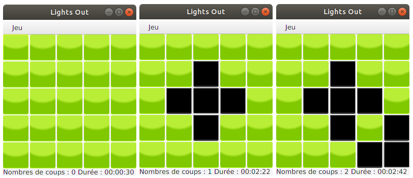

#  Module 2105 : Introduction aux IHM en Java 

## Test d'IHM et langage Java 

**Test du samedi 8 juin 2019 – Durée 2 heures – Documents autorisés**

L'objectif de cet exercice est la programmation d'une version JavaFx du jeu **Lights Out**. Lights Out est un jeu électronique 
publié par Tiger Electronics en 1995. 

Le jeu consiste en une grille de lumières de 5 sur 5. Lorsque le jeu commence, un nombre aléatoire ou un ensemble mémorisé 
de ces lumières est activé. En appuyant sur l'une des lumières, vous basculerez sur celle-ci et sur les lumières adjacentes. 
Le but du puzzle est d’éteindre toutes les lumières, de préférence en appuyant le moins possible sur les boutons.

### Travail à réaliser

L'IHM que vous allez en partie réaliser ressemblera à la fenêtre suivante :

L'objectif de ce test est d'évaluer votre capacité à écrire une IHM à l'aide du langage Java, les méthodes complexes car 
trop algorithmiques n'auront pas à être implémentées. Vous pourrez retrouver une proposition de correction à l'adresse 
suivante : https://github.com/IUTInfoAix-m2105/TestIHM2019/

L'application définit plusieurs types d'objets :
- Un objet `LightsOutMain` est une application JavaFX permettant de jouer.
- Un objet `LightOutIHM` est la racine de la scène de jeu (l'intérieur de la fenêtre de l'image).
- Un objet `LightOutBoard` est le plateau de jeu composé des 25 cases, que l'on voit au centre du `LightOutIHM`
- Un objet `Carreau` représente un carreau.
- Un objet `StatusBar` est la barre en bas du `LightOutIHM` qui affiche le score et l'état de la partie.

Le diagramme UML suivant donne un aperçu synthétique de la structure des classes de l'application. Il n'est pas nécessaire de l'étudier pour l'instant, mais il vous sera très utile pour retrouver les données membres et méthodes des différentes classes.

Votre travail dans la suite de ce sujet sera d'écrire pas à pas les 4 premières classes. Le code de la classe `StatusBar` 
vous est donné à titre d'information ci-dessous, pour que vous puissiez vous y référer si besoin au cours des exercices. 

